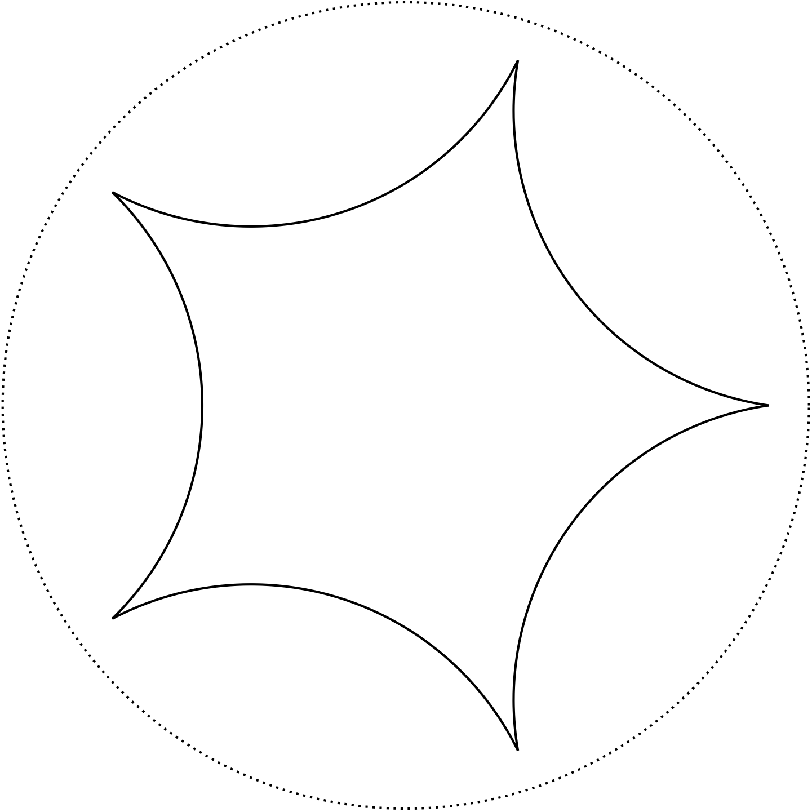

# Hyperbolic Plane


[](https://travis-ci.org/scheinerman/HyperbolicPlane.jl)


[](http://codecov.io/github/scheinerman/HyperbolicPlane.jl?branch=master)

## UNDER CONSTRUCTION

## Objects

### The Plane

The `HyperbolicPlane` module provides basic objects in the Hyperbolic
plane (realized as the Poincare Disc).

+ `HPlane()`: Represents the entire hyperbolic plane.

### Points

+ `HPoint(z)`: Creates a new point in the hyperbolic plane given by the
`Complex` number `z` (which must have absolute value less than 1).
+ `dist(p,q)`: return the distance between points `p` and `q`.
+ `midpoint(p,q)`

### Line Segments

+ `HSegment(a,b)`: Create a new line segment joining points `a` and `b`
(each specified as either a complex number or an `HPoint`).
+ `length(L)`
+ `midpoint(L)`
+ `endpoints(L)`

### Lines

+ `HLine(s,t)`: Create a new line. The line joins the points at infinity
on the boundary of the Poincare disk at locations `exp(im*s)` and `exp(im*t)`.
+ `point_on_line(L)` returns a point on the line `L`.


## Attributes

Various attributes can be assigned to hyperbolic objects. These attributes
are used by the `draw` function when the objects are rendered on the screen.

+ `set_color(X,color)` (all objects): Set the color of the object. (Default:
  `color=:black`.)
+ `set_radius(P,r)` (only points): Set the radius of the dot that
represents a point. (Default: `r=1`.)
+ `set_thickness(X,th)` (segments, lines, plane): Set the thickness
of the line drawn. (Default: `th=1`.)
+ `set_line_style(X,sty)` (segments, lines, plane): Set the line style
we use to draw this object. (Default: `sty=:solid`.) **Note**: a new
`HPlane()` has line style `:dot`.

For any hyperbolic object `X`, one can use `X[attribute]` to inspect or
modify any attribute setting. Here `attribute` is a `Symbol` that makes
sense as an argument for `plot`.

## Drawing

The `draw` function draws a hyperbolic object on the screen. Typically,
one begins a drawing with `plot()` to create a blank canvas. Then call
`draw(X)` for the various objects `X` to be rendered, and then conclude  
with `finish()` to clean up.

For example, executing this code produces a drawing of a regular
pentagon:
```julia
using HyperbolicPlane, Plots
n = 5
r = 0.9
points = [ HPoint(r * exp(2*k*pi*im/n)) for k=1:n ]

plot()
for j=1:n-1
    S = HSegment(points[j], points[j+1])
    draw(S)
end
S = HSegment(points[end], points[1])
draw(S)
draw(HPlane())
finish()
```


